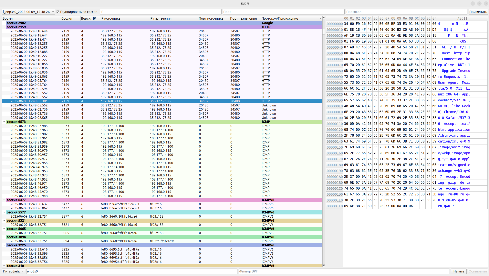

# ELDPI
Программное средство глубокого анализа сетевого трафика, разработанное на базе отечественных аппаратно-программных комплексов архитектуры "Эльбрус".  
Программа разработана в рамках выполнения выпускной квалификационной работы.
## Установка
Для установки необходимо:
1. запустить скрипт установки зависимостей
    ```
    sudo ./bootstrap.sh
    ```
2. Соберите проект
    ```
    sudo make
    ```
3. Установить программу
    ```
    sudo make install
    ```
## Удаление
Для удаления установленной программы выполните:
    ```
    sudo make uninstall
    ```
## Запуск
Для запуска программы:
    ```
    ELDPI
    ```
## Использование
